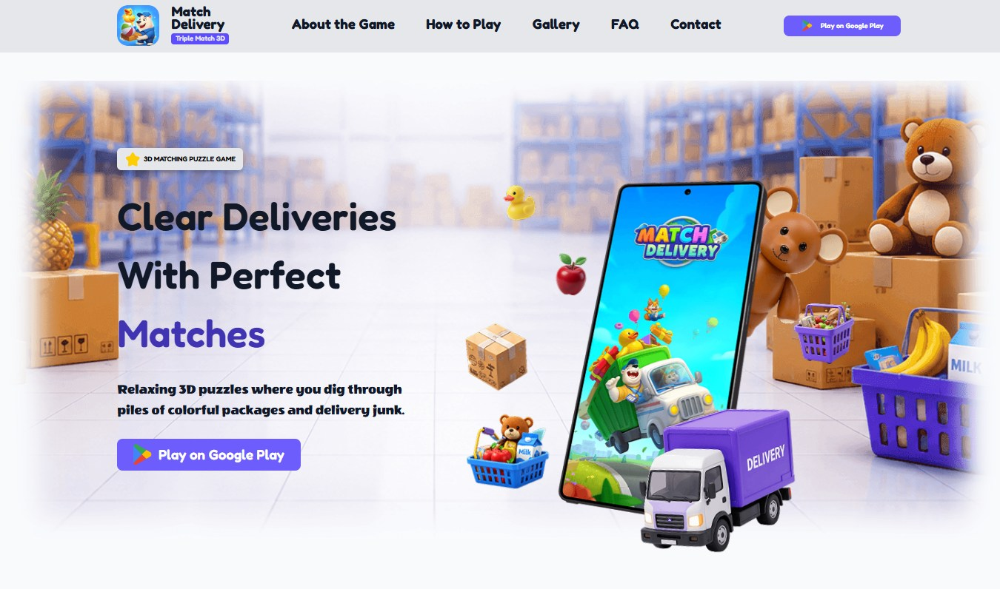

# Match Delivery - Puzzle game website



---

## 🛠 Tech Stack
Javascript, HTML, CSS

---

## Developers

- [@Anastacia-Tkachova](https://github.com/anastacia-tkachova)
- [@Andrii-Mitko](https://github.com/Andrii-Mitko)

## Designer

- [@PSUAH1(t.me)](https://t.me/PSUAH1)

---

## Features

- Live animations
- Cross platform

---

## Run Locally

Clone the project

```bash
  git clone https://github.com/anastacia-tkachova/STP-13021
```

Go to the project directory

```bash
  cd my-project
```

Install dependencies

```bash
  npm install
```

Start the server

```bash
  npm run start
```

---

